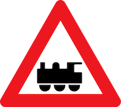

### Links
[home](../README.md) &#8226; [intro](introduction.md) &#8226; [env](environment.md) &#8226;
[data](data.md)

### Data

Before we can decide what to do, we need to get some understanding of what we have at our
disposal.  

#### Bounding the extent of the challenge

Focussing on the recognition stage for a moment, a comprehensive road sign classifier is
a significant undertaking. The number of distinct signs on our roads is incredibly large and ever
increasing. For example, here's a sign we didn't have on our roads until recently:

Evidently, I need to place restrictions to ensure feasibility.

- **descriptive**  The majority of signs are descriptive (e.g. direction, location etc.):

    

  Textual comprehension is beyond the scope of this project; I will restrict to
  symbolic comprehension. 

- **Vienna convention** Road signs are standardized by the [Vienna Convention on Road Signs and
  Signals](https://en.wikipedia.org/wiki/Vienna_Convention_on_Road_Signs_and_Signals).  This is a
  multilateral treaty designed to increase road safety and which the majority of European
  countries have ratified.  It categorizes signs into one of 8 groups:  

  |warning                                              |priority                                           |prohibitory                                           |mandatory                                               |
  |:---------------------------------------------------:|:-------------------------------------------------:|:----------------------------------------------------:|:------------------------------------------------------:|
  |||||

  |special                                                |informative                                             |indicative                                             |additional                                        |
  |:-----------------------------------------------------:|:------------------------------------------------------:|:-----------------------------------------------------:|:------------------------------------------------:|
  ||||                                         |

  
  
  

  and prescribes certain characteristics: shapes, colors, sizes.  Having said that, in any given
  country, there are certainly large numbers (>500) of distinct symbolic signs (see
  [here](https://en.wikipedia.org/wiki/Road_signs_in_Germany) for a sample of German signs and
  [here](https://www.dvr.de/publikationen/downloads/verkehrszeichen.html) where I located some nice
  pngs). Again, with an eye to future data collection, I will restrict to a very small number.

- **intraclass variety** For any given sign, there are very often national differences in the
  precise realization of signs, even among those countries signed up to the Vienna convention. For
  example, a quick look at
  [Wikipedia](https://en.wikipedia.org/wiki/Comparison_of_European_road_signs) yields the following:

  
  
  
  
  
  
  
  
  
  
  
  
  
  
  
  
  
  
  
  
  
  
  
  

  However, my data sources are unlikely to be so diverse. I'm based in Berlin, so any manual data
  collection will be local and as I'll discuss below, my core dataset is sourced in Germany, so
  I should expect a classifier that deteriorates in performance outside of Germany.  This is really
  not a concern for my project, as my live testing will also occur here.

#### GTSDB

As I stated earlier, the core dataset comes from the GTSDB (German Traffic Sign Detection
Benchmark). This [link](http://benchmark.ini.rub.de/Dataset_GTSDB/FullIJCNN2013.zip) downloads the
associated zip file and on the surface, it's a relatively meaty 1.6GB.  Unfortunately, the files are
in the rather inefficient Portable Pixmap format (24-bit-color images where each pixel is encoded as
uncompressed text). On closer inspection, there are only 900 images spread across 43 classes. Here
is their distribution:

<svg class="chart"></svg>

As its name suggests, this is a benchmarking dataset, so one course of action, would be to compare
any model I construct against the benchmark.  However, I'm not motivated to go down that road and
you can see why if you look inside the dataset: even within the more frequently occurring classes,
the environment is not particularly diverse. Of course, road signs occur *at roads*, so one
shouldn't expect a magical wonderland of diversity, but:

- **weather** Typically German, mostly cloudy with some sunny scenes. However, adverse
  conditions: rainy, sleety, stormy, snowy are underrepresented (some do not occur at all).

- **illumination** All are taken during the day, sunrise and sunset are underrepresented and
  nighttime scenes are completely absent.

- **line of sight** While there are examples of signs falling in varying degrees of shadow and some
  with moderate blur, no occlusion occurs.

Certainly, some of the signs are difficult to read so models doing better on this benchmark are
probably better in real life, but the benchmarking error rates are unlikely to hold any
precise meaning for real world applications. 

Given the constraints detailed [earlier](introduction.md), I find it more interesting (and indeed
more feasible) to develop a model restricted to a very small number of signs and attempt to evaluate
on live test data in a variety of conditions.

#### Statement of intent

I picked the following signs:

|priority road                                 |give way                                   |speed limit 30                          |speed limit 50                          |
|:--------------------------------------------:|:-----------------------------------------:|:--------------------------------------:|:--------------------------------------:|
|||||

for the several reasons:

- **frequency** They are among the most frequent in the GTSDB dataset. Moreover, I live within city
  limits, and generally 50km/h is the default speed limit within a German city, with 30km/h for
  smaller streets.  Since it is a small dataset a major consideration is the ability to collect more
  data.

- **interclass variation** It tests two criteria: that the model can pick out various shapes and
  colors (admittedly, this should be easily satisfied within the relatively high capacity models
  that I'm going to consider) and that it can pick out subtler differences (the speed limit signs
  differ only in the text).

With preliminary data at hand, let's pick out the models.

